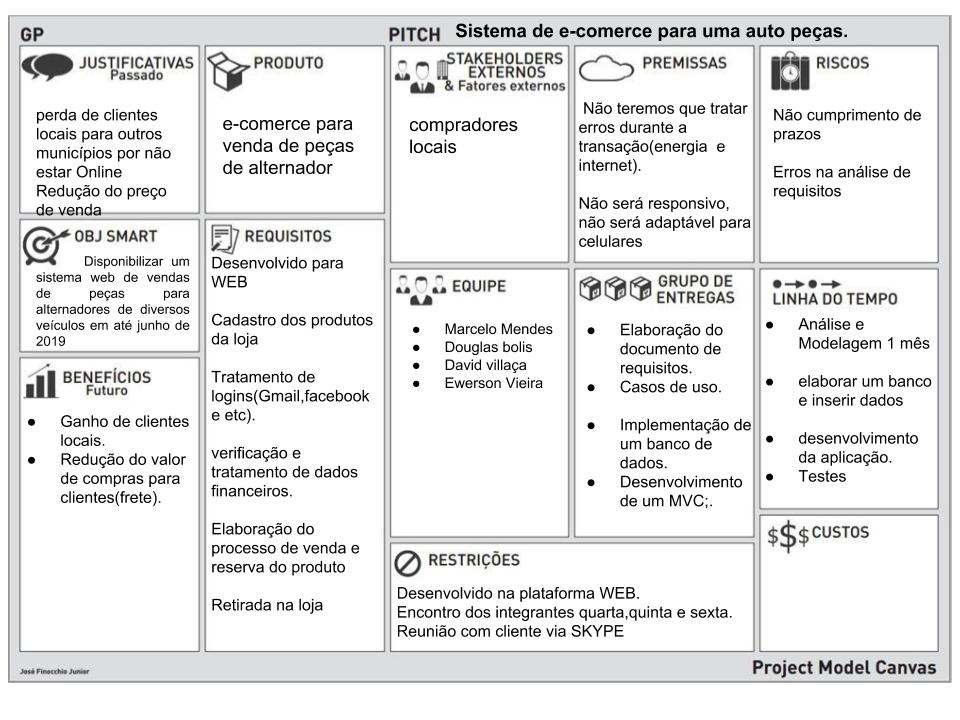

# Autopecas

## disciplinas

- [Programação Orientada a Objeto 2]()
- [Projeto de Sistemas]()
- [Banco de dados ]()

## Membros

1. David Villaça
2. Douglas Bolis
3. Ewerson Vieira
4. Marcelo Mendes

# árvore de arquivos

1. arquivos(todos arquivos editaveis .astah .bin .doc )
    1. analise
    2. banco_de_dados
    3. poo2
2. imagens (todas imagens relativas ao projeto)

3. analise
    1. analise_simplificada.md
4. banco_de_dados
    1. projeto_persistencia.md
5. poo2
    1. primeira 
    2. segunda
    3. terceira 
    4. quarta 
    5. diario_de_bordo.md
6. projeto_sistemas
    1. entrega 1
    2. entrega 2
    3. entrega 3
    4. readme.md
7. README.md

## Ciclo de Desenvolvimento de software

## Análise

### Minimundo
Nosso cliente Alan entrou em contato com a necessidade de um e commerce para sua loja de Autopeças especializada em alternadores, pequenos geradores que através de um eixo conectado por uma polia ao motor aproveitam o trabalho para gerar energia para bateria do carro, em conversa ele relatou o seguinte:

* Seus clientes estão tendo um problema que é não saber se uma determinada peça é ofertada em sua loja, com isso ele acredita estar perdendo vendas para seus concorrentes no site mercado livre.
* A loja está perdendo clientes locais que poderiam comprar na loja para vendedores do Mercado Livre, por não possuir a venda de peças online, mesmo tendo um preço melhor.
  
Sendo assim nosso cliente gostaria de expor seus produtos em um site e vendê-los, os produtos oferecidos na loja são mecânicos(rolamentos e polias) e elétricos(bobinas,regulador e rotor) todos eles possuem marca, número da peça e número OEM.
Número OEM é um número de licenciamento concedido a peças oficiais, um exemplo são notebooks da HP a tela deles é feita pela samsung a samsung teria um número OEM por conta disso, o número OEM é apenas para fornecedores veículos.
Entre as peças elétricas a bobina tem as suas dimensões, possui um diâmetro interno, amperagem e quantidade de pólos elétricos. 
O rotor por sua vez possui voltagem, amperagem, modelo e diâmetro.
Regulador possui apenas: amperagem, diâmetro e modelo.
Entre as peças mecânicas a polia tem uma quantidade de sulcos(marcações) e uma largura, o rolamento apenas suas dimensões são relevantes.
Nosso cliente disse que em tempos de crise o preço baixo tem sido uma solução para manter as vendas, uma estratégia dele seria a venda com retirada na loja, perde vendas não é algo bom ele também gostaria de ampliar suas formas de pagamento para cartão de crédito e boleto bancário.
Contudo o senhor Alan gostaria de um sistema disponível na internet para vendas de seus produtos.
 
### Diagrama de classe

### Protótipo
[Protótipo](https://github.com/MarceloMendes94/Autopecas/blob/master/analise/mockup.pdf) 

### Kanban
[Projeto de Sistemas](https://github.com/MarceloMendes94/Autopecas/projects/1) 

### Levantamento de requisitos

## Projeto

## Implementação

## Testes

## Implantação

## Canvas do projeto

