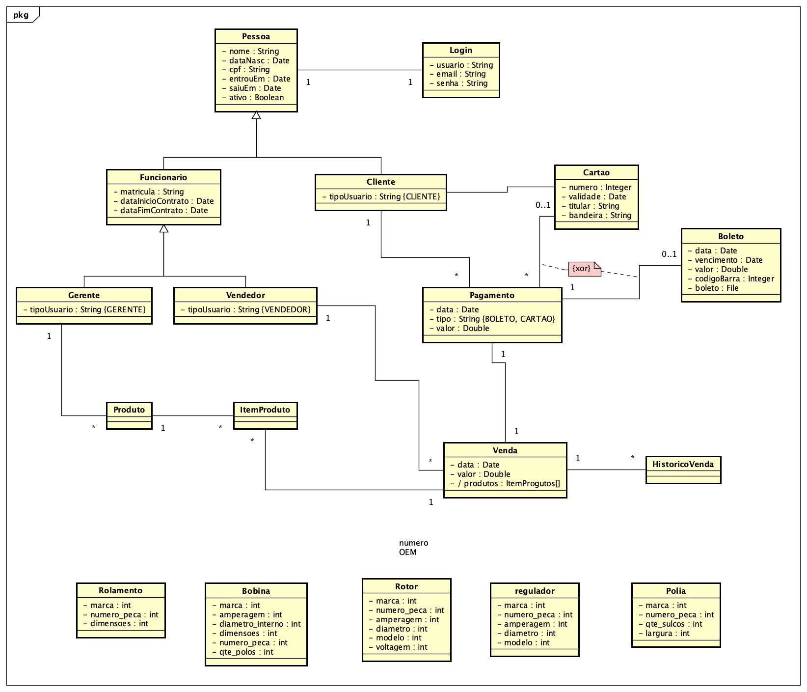

# Autopecas

## disciplinas

- [Programação Orientada a Objeto 2](https://github.com/MarceloMendes94/Autopecas/tree/master/poo2)
- [Projeto de Sistemas]()
- [Banco de dados 2]()
- [Engenharia de software]()

## Membros

1. David Villaça
2. Douglas Bolis
3. Ewerson Vieira
4. Marcelo Mendes

## Minimundo

Nosso cliente Alan entrou em contato com a necessidade de um e-comerce para sua loja de Autopeças, em conversa ele relatou o seguinte:

- Seus clientes estão tendo um problema que é não saber se uma determinada peça em sua loja, com isso ele acredita estar perdendo vendas para seus concorrentes.

- A loja está perdendo clientes locais que poderiam comprar na loja para vendedores do Mercado Livre, por não possuir a venda de peças online, mesmo tendo um preço melhor.

Sendo assim nosso cliente gostaria de expor seus produtos em um site e vendê-los apenas com retidas em loja, pois o custo de envio afetaria o preço do produto e o nosso cliente não tem interesse de realizar vendas para fora do estado. 

Por motivos de segurança o senhor Alan gostaria que as vendas fossem feitas fora do seu estabelecimento(cartão de crédito e boleto bancário) e com a estratégia de reduzir mais o custo operacional de sua empresa.

## Ciclo de Desenvolvimento de software

### Levantamento de requisitos

### Análise

#### Diagrama de classe

### Projeto

### Implementação

### Testes

### Implantação

### Canvas do projeto

### Diario de Bordo
|atividade|data|
|---------|----|
|Elaboração do Git do trabalho com hierarquia de pastas, disciplinas e etc.|26/02/2019|
|Criação do PMC em sala de aula e apresentação do mesmo.|27/02/2019|
|Início do documento de Análise.|02/03/2019|
|Elaboração do mini mundo defininco bem o escopo e aprofundando dentro das regras de negócio|03/03/2019|
|Desenvolvimento do diagrama de classes baseado no mini mundo.|04/03/2019|
|Levantamento de requisistos do sistema.|04/03/2019|
|||
