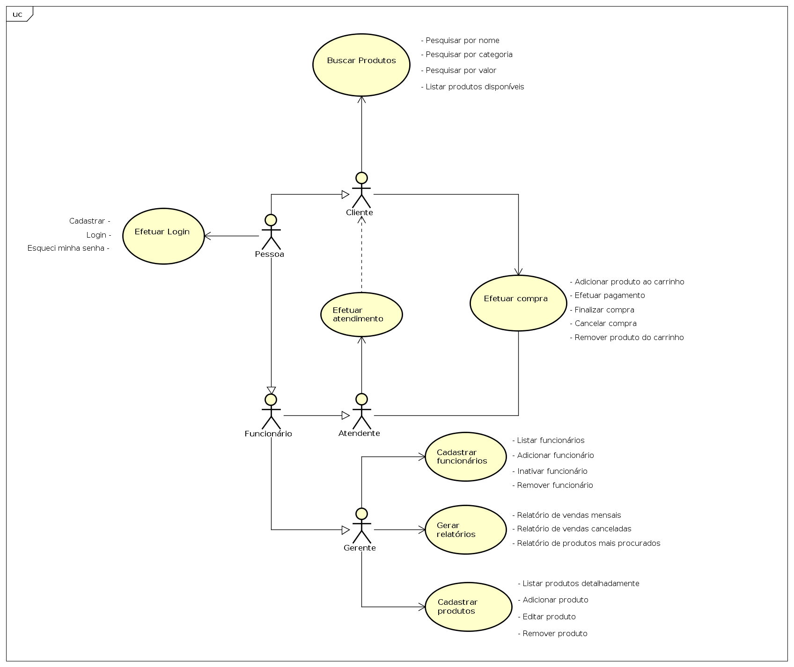
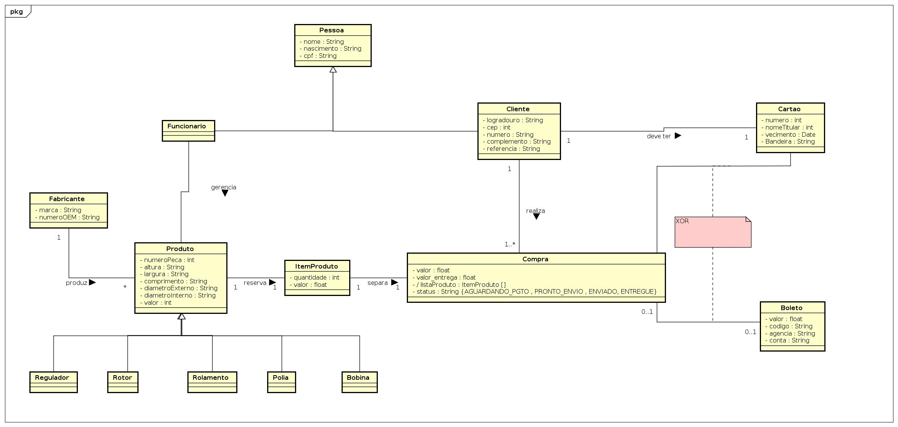

# Primeira entrega  PS 20191

## entregáveis
1. Requisitos não funcionais 
2. Regras de negócio 
3. Casos de Uso 
4. Diagrama de classes 

## grupo
1. David Villaça
2. Douglas Bolis
3. Ewerson Vieira
4. Marcelo Mendes

### Requisitos não funcionais
|Identificador|Descrição|Categoria|Escopo|Prioridade|
|-------------|---------|---------|------|----------|
|RNF01|O sistema deve estar integrado ao Sistema de Operadoras de Cartão de Crédito para enviar e receber informações para pagamento com cartão de crédito.|Autenticação|Funcionalidade|Alta|
|RNF02|O sistema deve controlar o acesso às funcionalidades. Funcionalidades para controlar o acervo de produtos e gerenciamento de usuários devem ser restritas ao administrador do sistema. Funcionalidades de consulta e compra dos produtos devem estar disponíveis para os usuários.|Autorização|Sistema|Alta|
|RNF03|O sistema, de acordo com a RNF01, deve requisitar a inserção de dados referentes à um outro cartão de crédito caso o cartão que o usuário esteja utilizando encontre-se vencido.|Modificabilidade|Funcionalidade|Alta|
|RNF04|O sistema deve alertar o usuário ao adicionar um item à sua compra.|Proteção contra erros do usuário.|Funcionalidade|Média|
|RNF05|O sistema deve estar disponível na Internet a partir dos principais navegadores disponíveis no mercado.|Operacionalidade|Funcionalidade|Média|
|RNF06| A persistência das informações deve ser implementada, em um primeiro momento, em um Sistema Gerenciador de Bancos de Dados Relacionais (SGBDR) livre (Postgres ou MySQL). Contudo, no futuro deve ser possível utilizar outros SGBDRs ou até mesmo outra tecnologia de banco de dados.|Reusabilidade|Sistema|Média|
|RNF07|O tempo para realização das funções do cliente deve ser inferior a cinco segundos, a partir da correta entrada de dados.|Inteligibilidade|Funcionalidade|Alta|
|RNF08|O administrador do sistema deve ser capaz de identificar erros que eventualmente ocorrerem.|Analisabilidade|Funcionalidade|Alta|
 
 

### Regras de negócio
|Identificador|Descrição|Prioridade|
|--|--|--|
|RN01|O valor de cada produto é informado pelo dono da empresa.|Alta|
|RN02|O sistema deve manter o histórico de vendas e, portanto, usuários que efetuaram alguma compra no site não poderão ser excluídos.|Alta|
|RN03|Pagamentos podem ser feitos via boleto bancário ou cartão.|Alta|
|RN04|Não existirá devolução de produtos.|Alta|
|RN05|A troca de produtos se dará de acordo com contato estabelecido pelo usuário com a empresa.|Alta|
|RN06|A troca de produtos só poderá ser realizada até 7 dias após a entrega do produto ao usuário.|Alta|
 
 

### Casos de Uso

 
 

### Diagrama de classes
