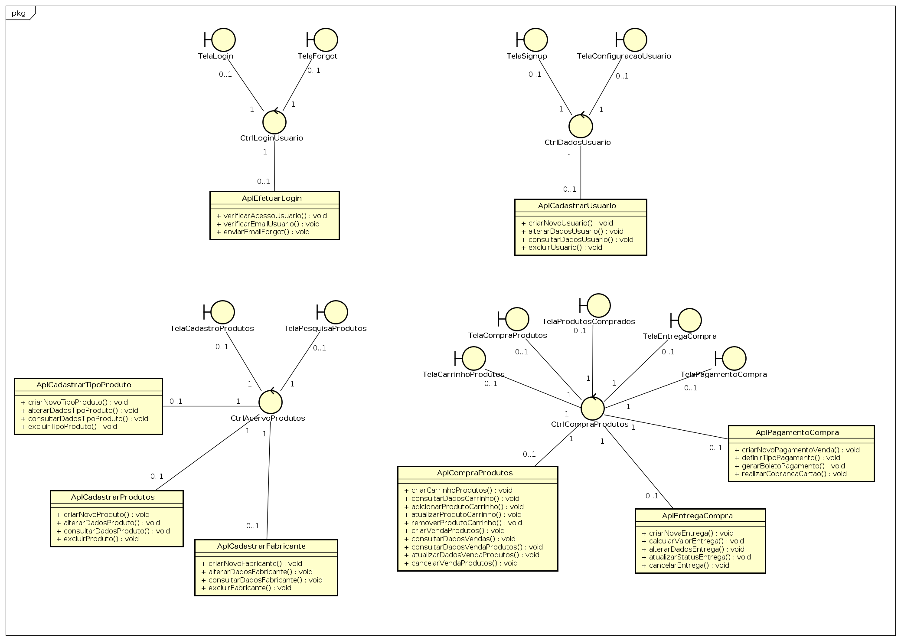
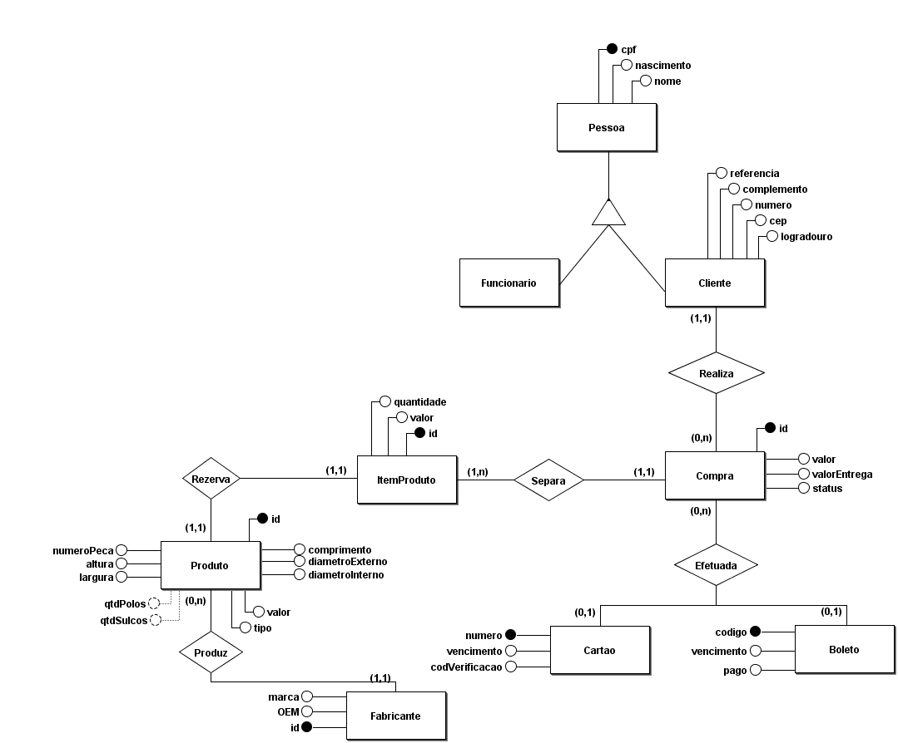
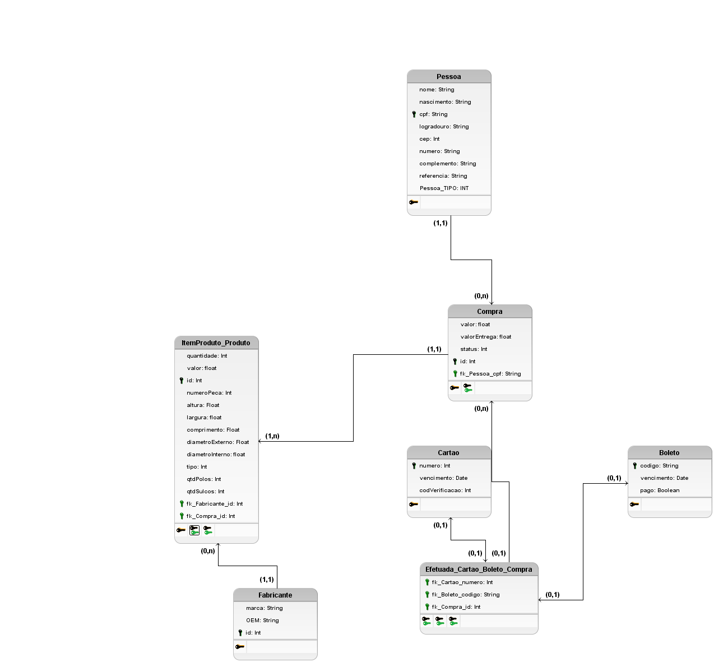
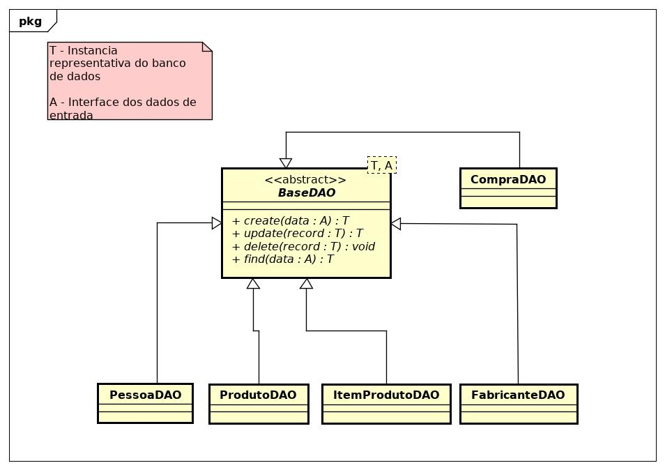

# Terceira entrega  PS 20191

## Entregáveis
1. Plataforma de Implementação
2. Definir Táticas para tratar Atributos de qualidade
3. Elaborar Arquitetura lógica do Sistema

## Grupo
1. David Villaça
2. Douglas Bolis
3. Ewerson Vieira
4. Marcelo Mendes

## Projeto do Domínio

#### Diagrama de Classes do Projeto

## Projeto da Interface com o Usuário

#### Protótipo de Tela

[prototipo](../imagem/Mockup_PS.pdf)

#### Diagrama Estrutural da Interface com o Usuário

## Projeto da Persistência

#### Modelo Lógico do Banco

#### Diagrama de Classes da Persistência

