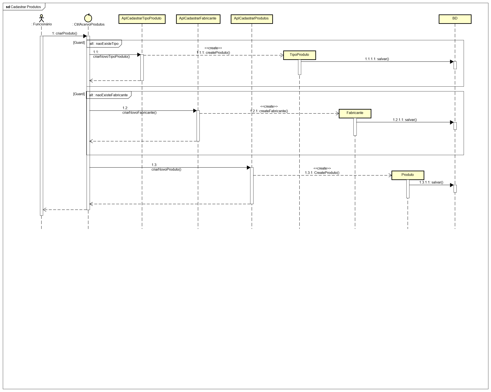
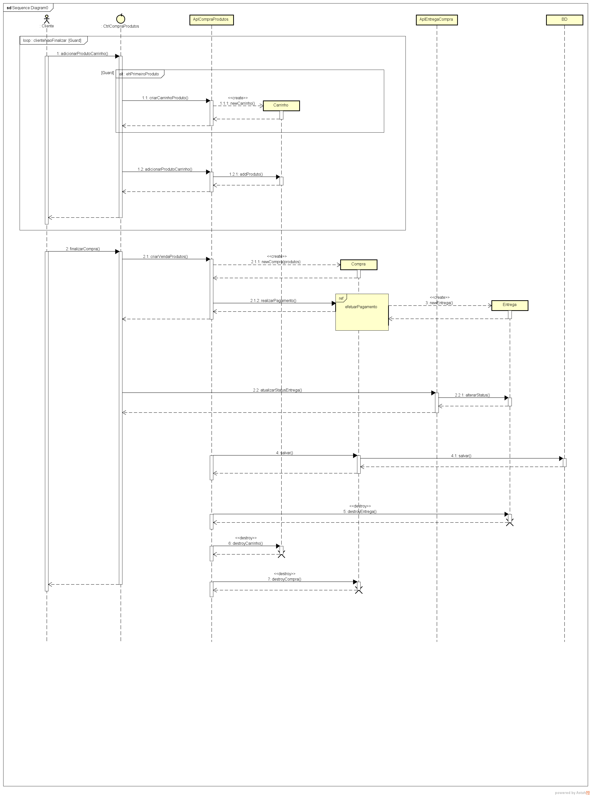
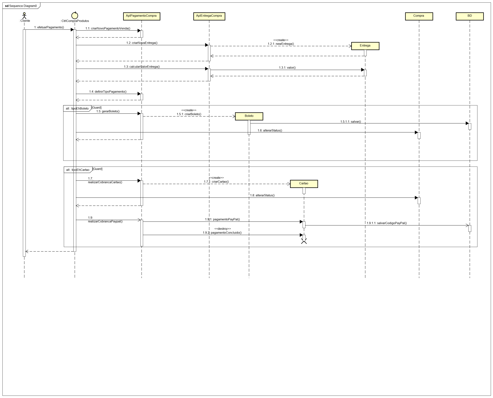

# Quarta entrega  PS 20191

## Entregáveis
1. Heurísticas de Nielsen
2. Mockup atualizado de acordo com o item 1
3. Diagramas de sequência

## Grupo
1. David Villaça
2. Douglas Bolis
3. Ewerson Vieira
4. Marcelo Mendes

## Heurísticas de Nielsen
Heurísticas presentes no protótipo:

1 - <b>Visibilidade do status do sistema</b> -> informar ao usuário o que ele pesquisou e as especificações possíveis da pesquisa.

1 - <b>Visibilidade do status do sistema</b> -> feedback de compra.

2 - <b>Equivalência entre sistema e mundo real</b> -> ícones universais.

3 - <b>Controle do usuário e liberdade</b> -> possibilidade de voltar ou cancelar atos no sistema.

6 - <b>Reconhecimento x memorização</b> -> adicionar "migalha de pão".

7 - <b>Flexibilidade e eficiência de uso</b> -> variedade de tipos de login via redes sociais.

8 - <b>Estética e design minimalista</b> -> uso de menu/aba.

8 - <b>Estética e design minimalista</b> -> interface com poucas informações.

10 - <b>Ajuda e documentação</b> -> uso de labels para ajudar o usuário.

10 - <b>Ajuda e documentação</b> -> uso de tooltip para guiar o preenchimento de dados.

## Protótipo de telas com heurísticas de Nielsen

[Mockup](../imagem/Mockup_PS.pdf)

## Diagramas de sequência

### Cadastrar produtos

### Efetuar compra

### Efetuar pagamento
